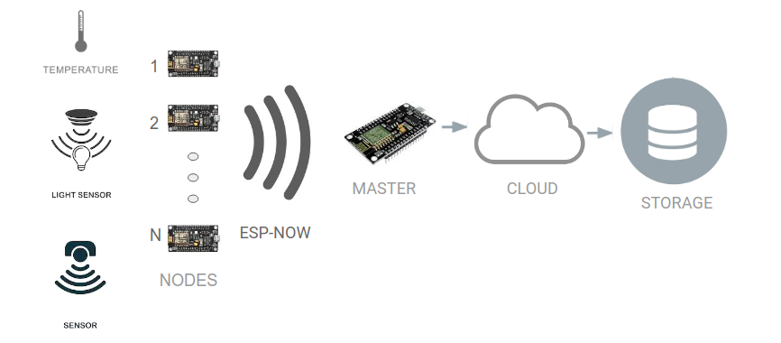

# Smart Room

### Goals: Create an IoT environment in a room with low WiFi signals. 

The project is summarized in  Figure 1.

The environment includes N nodes that can be connected with any sensor. Those nodes connect with a master-node with a radio protocol ESP-NOW ( without using any internet ). The master connects with the cloud using the internet and achieves the storage.

The project has an implementation for two types of backend:

- Firebase backend

Pros:

- Fast prototype
- Database easy to manage
- Google Robustness

Cons:

- Limited Storage
- Limited Internet Bandwith
- No user Dashboards

- Thingsboard backend

Pros:

- Open Source
- Easy to install with docker container
- Easy to set up its environment
- Users Dashboard with different levels of permission

Cons:

- Since it is installed locally, you have to lead with its maintenance ( e.g., energy fails, internet downs, etc.)

.